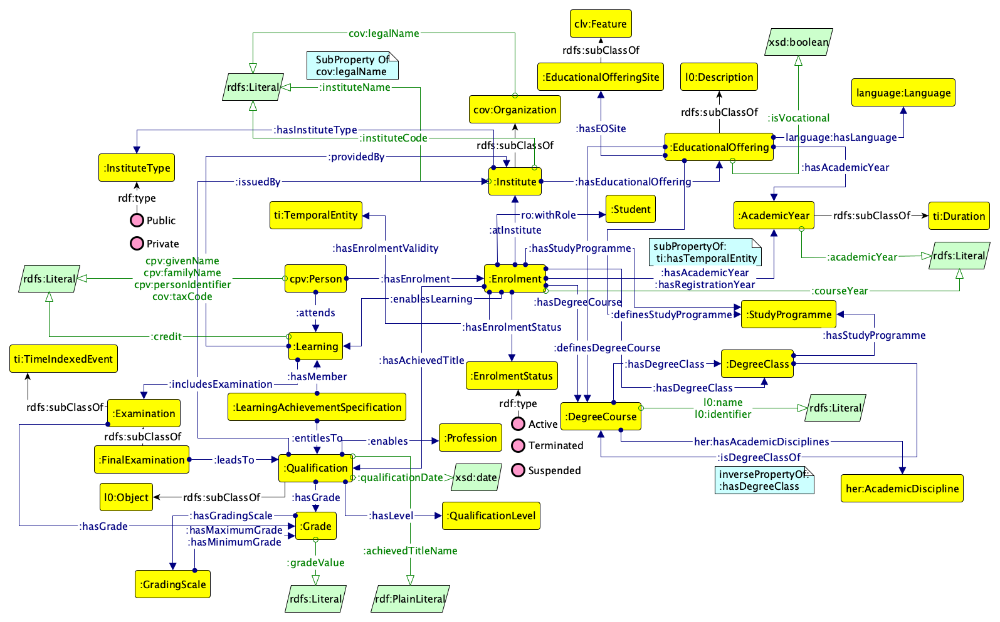

Learning - Ontologia Italiana della Formazione (inclusa AFAM)
=============================================================

Questa è l'ontologia del profilo applicativo italiano della (alta) formazione e AFAM - Alta Formazione Artistica, Musicale e Coreutica.
L'ontologia modella informazioni come l'iscrizione a istituti (e.g., Università, Istituti AFAM), il titolo ottenuto con la relativa votazione, l'offerta formativa di questi istituti. La modellazione è usata per definire le API della banca dati ANIS - Anagrafe Nazionale Istruzione Superiore, nonché per supportare specifici casi d'uso e mappare alcune evidenze nel contesto del regolamento Europeo sul Single Digital Gateway.

Al momento l'ontologia non modella le informazioni relative a periodi erasmus e alla mobilità di uno studente, nonché criteri di ammissione ai corsi di laurea. In successive revisioni dell'ontologia si raccoglieranno requisiti per modellare anche questi aspetti.

L'ontologia nasce da una collaborazione tra diversi attori del mondo alta formazione: MUR, CODAU, CRUI e rappresentanti del settore AFAM.

Lo schema del modello attuale è rappresentato dalla seguente figura:

