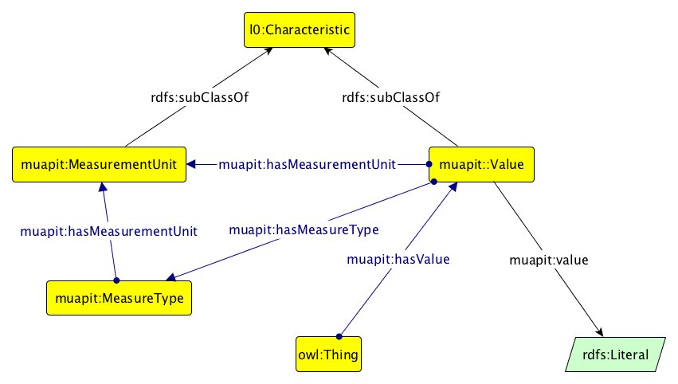

MU-AP_IT Profilo Italiano dell'ontologia dei Valori e delle Unità di Misura
===========================================================================

L’ontologia **è da riternersi STABILE** e rappresenta la semplice modellazione di valori e di relative Unità di Misura.

 è rappresentato in Graffoo, un software di rappresentazione grafica di ontologie sviluppato dall'Università di Bologna.
 è sempre rappresentato in Graffoo mendiante l'esplicitazione di individui (istanze) modellate con l'ontologia.
