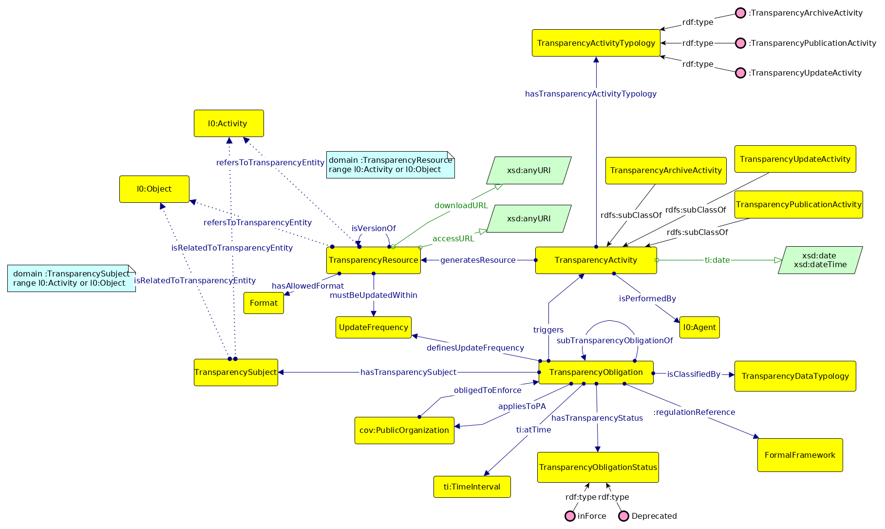

L'ontologia Transparency-AP_IT
================================

L'ontologia [Transparency-AP_IT](./Transparency-AP_IT.ttl) modella gli obblighi di trasparenza della pubblica amministrazione italiana.

Gli obblighi di trasparenza sono descritti dalle seguenti norme:
* [DECRETO LEGISLATIVO 14 marzo 2013, n. 33](https://www.gazzettaufficiale.it/eli/id/2013/04/05/13G00076/sg) 
* [DECRETO LEGISLATIVO 25 maggio 2016, n. 97](https://www.gazzettaufficiale.it/eli/id/2016/06/08/16G00108/sg) 

che costituiscono la base di analisi ai fini della modellazione. 

Le [Linee guida ANAC](https://www.anticorruzione.it/portal/public/classic/AttivitaAutorita/AttiDellAutorita/_Atto?ca=6667) forniscono una sintesi dalla quale le 
pubbliche amministrazione possono ricavare le indicazioni su come applicare le normative.

## Il modello

A valle dell'analisi delle fonti è emersa l'esigenza di descrivere alcuni elementi chiave per l'organizzazione dei contenuti rilevanti, 
e l'applicazione dei vari obblighi.

Gli elementi centrali nel modello dati sono pertanto i concetti di: 
- obbligo di trasparenza (`TransparencyObligation`)
- tematiche (`TransparencySubject`) come punto di contatto tra obblighi e ontologie di dominio (OntoPiA).
- attività  (`TransparencyActivity`) compiute dalle pubbliche amministrazione per adempiere agli obblighi della trasparenza
- risorse  dati (`TransparencyResource`)

Lo schema del modello è rappresentato nella figura seguente

dove si è utilizzata la notazione [graffoo](http://www.essepuntato.it/graffoo).

L'obbligo di trasparenza (`TransparencyObligation`) è definito come una collezione di temi (`TransparencySubject`) che identificano le informazioni da pubblicare, 
secondo modalità specifiche (aggiornamento e formato), nell'apposita sezione di "Amministrazione Trasparente".
I titioli delle sezioni e sottosezioni di "Amministrazioni Trasparente", definite dalla normativa, sono state codificate 
in un voacabolario controllato ([transparency-titulus](../VocabolariControllati/classifications-for-transparency/transparency-titulus)).
Le voci del vocabolario forniscono, inoltre, una classificatione delgi obblighi di trasparenza 
rispetto alla tipologia di dati da pubblicare (`TransparencyDataTypology`).

Gli obblighi di trasparenza prevedono che le amministrazioni gestiscano i dati previsti dalle norme in modo da rendere fruibile l'informazione.
Queste attività sono state modellate nell'ontologia introducendo il concetto di `TransparencyActivity` (e alcune sue specializzazioni). 
L'attività di trasparenza (vedi: [PROV-O](https://www.w3.org/TR/prov-o/)) ha come risultato la generazione di una risorsa (`TransparencyResource`), che rappresenta il contenuto informativo che sarà accessibile
dalla sezione "Amministrazione Trasparente". 

I dati contenuti nelle risorse pubblicate dalle amministrazioni come conseguenza di un obbligo di trasparenza, faranno riferimento a domini verticali
specifici, in genere identificabili tramite i temi degli obblighi. 
Per questo motivo è stata materializzata la relazione delle `TransparencyResource` e  i `TransparencySubject` con i concetti e le entità modellate nelle ontologie di OntoPiA.

A supporto e descrizione di questo modello è stato realizzato un [esempio](./example-01.ttl) basato su dati reperiti sul sito web di una pubblica amministrazione presa a campione.

## Proposte di evoluzione

Ai fini della definizione del modello è emerso come sia opportuno realizzare due vocabolari controllati a supporto dell'ontologia,
in particolare:

* Vocabolario controllato obblighi della trasparenza (`TransparencyObligation`)
* Vocabolario controllato delle tematiche di trasparenza (`TransparencySubject`)

La realizzazione di questi vocabolari è lasciata ad un lavoro successivo.

## Approfondimenti

+ [OntoPiA - Ontologia dei Contratti Pubblici](https://github.com/italia/daf-ontologie-vocabolari-controllati/tree/master/Ontologie/PublicContract)

+ [FAIR data principles](https://libereurope.eu/wp-content/uploads/2017/12/LIBER-FAIR-Data.pdf):
	1. *Findable*
	2. *Accessible*
	3. *Interoperable*
	4. *Reusable*

+ [PROV-O](https://www.w3.org/TR/prov-o/)

+ [Open Government Directive](https://obamawhitehouse.archives.gov/sites/default/files/omb/assets/memoranda_2010/m10-06.pdf)

+ [A Proposal of Ontology about Brazilian Government Transparency Portal](https://www.researchgate.net/publication/283569612_A_Proposal_of_Ontology_about_Brazilian_Government_Transparency_Portal)

+ [PPROC, an Ontology for Transparency in Public Procurement](http://www.semantic-web-journal.net/system/files/swj1142.pdf)

+ [Towards a transparency ontology in the context of open government](https://www.researchgate.net/publication/310778030_Towards_a_transparency_ontology_in_the_context_of_open_government)

+ [An Ontology-Based Approach to Use Requirements Engineering in Portals of Transparency](http://ceur-ws.org/Vol-1862/paper-13.pdf)

