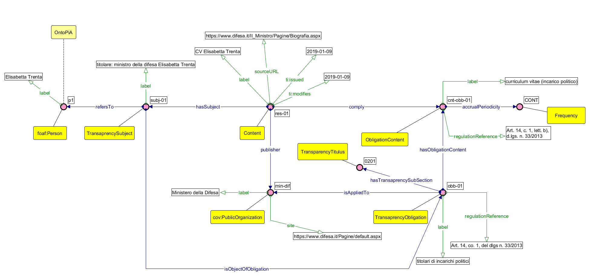
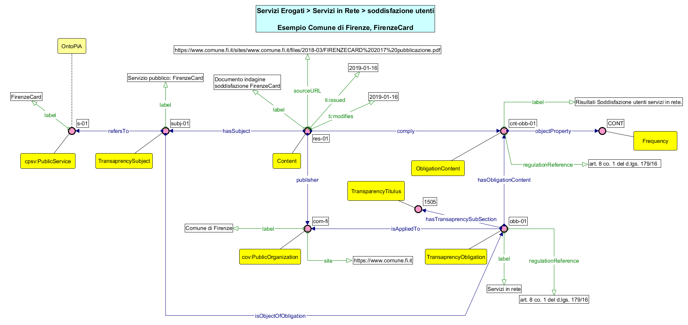
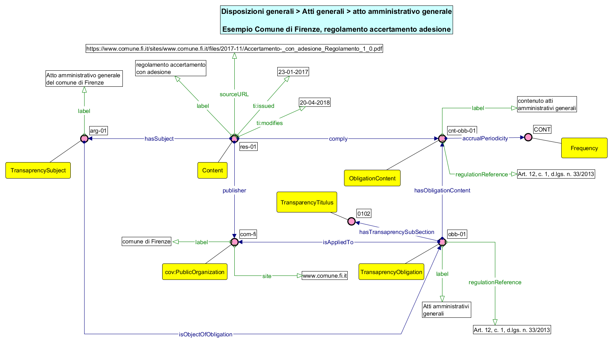

L'ontologia Transparency-AP_IT
================================

Il modello ontologico della trasparenza [Transparency-AP_IT](./Transparency-AP_IT.ttl) è stato immaginato come punto di incontro di tre elementi:

 *  le norme sulla trasparenza:
     * [DECRETO LEGISLATIVO 14 marzo 2013, n. 33 ](https://www.gazzettaufficiale.it/eli/id/2013/04/05/13G00076/sg) 
     * [DECRETO LEGISLATIVO 25 maggio 2016, n. 97](https://www.gazzettaufficiale.it/eli/id/2016/06/08/16G00108/sg) 
 * la modellazione dei domini dei contenuti degli obblighi da parte delle ontologie dedicate
 * l’esigenza di supportare un applicativo finalizzato a guidare le pubbliche amministrazioni nella pubblicazioni dei contenuti

A seguito di tali considerazioni, è emerso come il concetto di "obbligo di trasparenza" possa essere focalizzato come l'elemento che caratterizza la relazione tra una pubblica amministrazione e un contenuto informativo pubblicato nella sezione "Amministrazione trasparente". In questo modello il concetto di obbligo viene materializzato e gli individui ad esso associati assumono delle proprietà che riflettono le indicazioni delle norme.

## Il modello

La modellazione del contenuto informativo da pubblicare è stata improntata come *profilo di metadatazione*: la ricognizione sui siti istituzionali delle pubbliche amministrazioni prese a campione ha evidenziato la caratterizzazione documentale dei contenuti pubblicati.
Al fine di predisporre il collegamento con ontologie di dominio specifiche, quando esistenti, e di effettuare il collegamento ad eventuali dati già rappresentati secondo tali modelli, si è deciso di introdurre entità di collegamento.

Questi elementi hanno prodotto ad un primo modello dell’ontologia  `Transparency_AP-IT`, rappresentato in figura:

dove si è utilizzata la notazione [graffoo](http://www.essepuntato.it/graffoo)

L’ontologia si basa sui seguenti concetti principali:
 - **Contenuto:** (`Content`) rappresenta i documenti, le informazioni e i dati oggetto di pubblicazione nei siti istituzionali delle pubbliche amministrazioni. Di tutti i contenuti pubblicati sono di interesse per il presente contesto solo quelli che riferiscono  (ottemperano) gli obblighi di trasparenza.
 - **Argomento:** (`TransparencySubject`) rappresenta il soggetto a cui fa riferimento il contenuto da pubblicare. I soggetti di riferimento nel presente contesto sono solo quelli che trovano riscontro negli obblighi di trasparenza. L’argomento costituisce il punto di aggancio ad eventuali concetti modellati nelle ontologie di dominio di OntoPiA.
 - **Obbligo di trasparenza:** (`TransparencyObligation`) rappresenta gli argomenti oggetto di obbligo di pubblicazione per la normativa sulla trasparenza. Fa riferimento alla colonna “denominazione obbligo” dell’[Allegato 1 della del.1310/2016 ANAC](http://www.anticorruzione.it/portal/public/classic/AttivitaAutorita/AttiDellAutorita/_Atto?ca=6667). Si collega alle voci della tassonomia [**transparency-titulus**](https://w3id.org/italia/controlled-vocabulary/classifications-for-trasparency/transparency-titulus/), che ne definiscono la corretta collocazione nella sezione “Amministrazione Trasparente” dei siti istituzionali.
 - **Contenuto obbligo:** (`ObligationContent`) rappresenta il contenuto informativo riferito ad un obbligo di trasparenza oggetto di pubblicazione. Fa riferimento alla colonna “contenuto dell'obbligo” dell’[Allegato 1 della del.1310/2016  ANAC](http://www.anticorruzione.it/portal/public/classic/AttivitaAutorita/AttiDellAutorita/_Atto?ca=6667).

## Esempi di applicazione

Di seguito proponiamo alcuni esempi di applicazione dell'ontologia [Transparency-AP_IT.ttl](./Transparency-AP_IT.ttl), basati su dati reali presi a campione dai siti istituzionali di alcune pubbliche amministrazioni.
Tali esempi sono stati utilizzati per l'analisi dei requisiti, ed il test dell'ontologia.

### 1. Organizzazione &rarr; Titolari di incarico politico &rarr; CV

L'esempio [ex-01](./examples/ex-01.ttl) riguarda l'obbligo di pubblicazione del CV del m inistro della difesa.

I riferimenti sono:
 - [Pubblica amministrazione: Ministero della Difesa](https://www.difesa.it/Pagine/default.aspx)
 - [Contenuto: CV Del Ministro](https://www.difesa.it/Il_Ministro/Pagine/Biografia.aspx)
 - [Argomento: Il Ministro della Difesa, Dottoressa Elisabetta Trenta](https://www.difesa.it/Amministrazionetrasparente/direttacollaborazioneministro/Pagine/il_ministro.aspx)

### 2. Servizi erogati &rarr; servizi in rete &rarr; soddisfazione utenti

L'esempio [ex-03](./examples/ex-03.ttl) riguarda l'obbligo di pubblicazione della soddisfazine utenti dei servizi in rete.

I riferimenti sono:
 - [Pubblica amministrazione: Comune di Firenze](https://www.comune.fi.it/)
 - [Contenuto: documento “FirenzeCard 2017 i turisti e la città di Firenze”](https://www.comune.fi.it/sites/www.comune.fi.it/files/2018-03/FIRENZECARD%202017%20pubblicazione.pdf)
 - Argomento: Servizio in rete FirenzeCard

### 3. Disposizioni generali &rarr; atti generale &rarr; atto amministrativo generale

L'esempio [ex-06](./examples/ex-06.ttl) riguarda l'obbligo di pubbligazione di atti amministrativi generali

I riferimenti sono:
 - [Pubblica amministrazione: Comune di Firenze](https://www.comune.fi.it/)
 - [Contenuto: regolamento di accertamento con adesione](https://www.comune.fi.it/sites/www.comune.fi.it/files/2017-11/Accertamento-_con_adesione_Regolamento_1_0.pdf)
 - Argomento: atto amministrativo generale del Comune di Firenze

* * *

## l'approccio utilizzato

Il tema della trasparenza si configura [1] come uno dei tre principi fondanti dell'open governement:
1. trasparenza
2. collaborazione
3. partecipazione

La prima esigenza è quella dell'accesso e della gestione ad una grande ed eterogenea mole di dati pubblicati nelle sezioni di trasparenza, e del loro legame con gli specifici modelli dati strutturati e focalizzati sui vari domini di rappresentazione.

Il tema della trasparenza impone la lettura di dati provenienti da ambiti tra loro molto differenti, e pone quindi anche degli interrogativi rispetto all'identificazione degli utenti a cui destinare il lavoro.
Si pone cioè da un lato la necessità di favorire l'accesso alle risorse nella maniera ri-mediata più semplice possibile [4][5], al fine di supportare ad esempio interrogazioni tematiche, ed analisi indipendenti. Dal punto di vista opposto sembra emergere la necessità di approfondire le tematiche verticali con opportune ontologie (vedi ad esempio lavori sul tema dei contratti pubblici: ad esempio [3], [7]), al fine di favorire la rappresentazione robusta dei dati, e la loro interoperabilità [5].

L'esigenza di rappresentazione della trasparenza si riconfigura quindi in una esigenza di metadatazione, e di supporto ad applicazioni e servizi.

La strategia utilizzata (che si ispira parzialmente ad esperienze esistenti [2][3][5]), parte quindi dall'esame degli obblighi di pubblicazione ai fini di trasparenza su alcuni dei portali nazionali, presi come campione rappresentativo del quadro nazionale.

L'obiettivo è quello della definizione di un approccio articolato in *quattro azioni* differenti sui documenti:
1. identificazione ed analisi del patrimonio informativo esistente, oggetto di obbligo di trasparenza
2. supporto alla trovabilità [6] ed alla condivisione del materiale oggetto di trasparenza
3. formalizzazione di un profilo di metadatazione da utilizzare a supporto della pubblicazione di documenti e risorse di vario genere [6]
4. analisi e sviluppo di ontologie verticali su domini definiti

### approfondimenti

+ [1] [Open Government Directive](https://obamawhitehouse.archives.gov/sites/default/files/omb/assets/memoranda_2010/m10-06.pdf)

+ [2] [A Proposal of Ontology about Brazilian Government Transparency Portal](https://www.researchgate.net/publication/283569612_A_Proposal_of_Ontology_about_Brazilian_Government_Transparency_Portal)

+ [3] [PPROC, an Ontology for Transparency in Public Procurement](http://www.semantic-web-journal.net/system/files/swj1142.pdf)

+ [4] [Towards a transparency ontology in the context of open government](https://www.researchgate.net/publication/310778030_Towards_a_transparency_ontology_in_the_context_of_open_government)

+ [5] [An Ontology-Based Approach to Use Requirements Engineering in Portals of Transparency](http://ceur-ws.org/Vol-1862/paper-13.pdf)

+ [6] [FAIR data principles](https://libereurope.eu/wp-content/uploads/2017/12/LIBER-FAIR-Data.pdf):
	1. *Findable*
	2. *Accesible*
	3. *Interoperable*
	4. *Reusable*

+ [7] [OntoPiA - Ontologia dei Contratti Pubblici](https://github.com/italia/daf-ontologie-vocabolari-controllati/tree/master/Ontologie/PublicContract)

## possibili future evoluzioni

Tra gli obiettivi previsti di prossima evoluzione dell'ontologia c'è senz'altro la necessità di formalizzare esigenze di tipo differente:
1. esigenze di modellazione degli attori coinvolti: è ipotizzabile l'introduzione nel modello di esplicite rappresentazioni delle diverse tipologie di utenti interessati alle tematiche di trasparenza
2. esigenze di ricerca tematica, per analisi mirate: ad esempio tramite l'introduzione di metadati orientati alla correlazione tra tipologie di dati ed analisi o visualizzazioni ad essi applicabili
3. esigenze di natura applicativa: ad esempio per facilitare la compilazione delle sezioni di trasparenza, e la pubblicazione dei relativi documenti, ad uso di utenti all'interno di gruppi di lavoro nella pubblica amministrazione
4. esigenze di descrizione dei processi di gestione dei documenti oggetto di trasparenza, spesso pubblicati anche a prescindere dagli obblighi normativi, al fine di facilitarne l'integrazione, e la razionalizzazione

