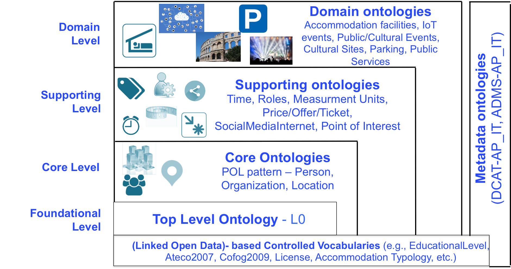

# Ontologie e Vocabolari Controllati

Questo è il repository ufficiale delle ontologie e dei vocabolari controllati sviluppati nell'ambito delle azioni previste dal piano triennale per l'informatica della Pubblica Amministrazione e a supporto del lavoro da svolgere per l'[elenco delle basi di dati chiave](http://elenco-basi-di-dati-chiave.readthedocs.io/it/latest/) e il paniere dinamico.
Le ontologie create sono tra loro collegate creando una vera e propria rete chiamata **OntoPiA** - an OntoNet system. Le ontologie sono in parte inserite nel catalogo delle ontologie e vocabolari controllati (si veda la parte [daf-semantics](https://github.com/italia/daf-semantics) e [ontonethub](https://github.com/teamdigitale/ontonethub) per il software relativo al catalogo).
Al momento esiste una versione alpha del catalogo ospitato nella PDND (Piattaforma Digitale Nazionale Dati), in particolare le ontologie sono nella [sezione Linked Data - ontologie](https://dataportal.daf.teamdigitale.it/#/ontologies) e i vocabolari controllati nella [sezione Linked Data - vocabolari](https://dataportal.daf.teamdigitale.it/#/vocabularies).

Il repository è suddiviso in due directory:

  + **Ontologie (Ontologies)**: contiene le ontologie OWL, serializzate in RDF/Turtle RDF/XML e JSON-LD. I diagrammi UML delle ontologie sono attualmente in fase di definizione e revisione a seguito dei collegamenti abilitati tra tutte le ontologie. Le ontologie hanno label e commenti sia in inglese (EN), sia in italiano (IT).
  + **Vocabolari controllati (Controlled Vocabularies)**: contiene un elenco dei vocabolari controllati sviluppati anche a supporto delle ontologie.

Il contenuto della directory **Ontologie** è attualmente il seguente:

  + **[IoT](https://w3id.org/italia/onto/IoT) (IoT Events - Eventi IoT - IoT-AP_IT)**: Ontologia del profilo applicativo italiano degli eventi IoT (IoT-AP_IT - IoT Italian Application Profile). **Questa ontologia può ritenersi stabile**
  + **[CPV](https://w3id.org/italia/onto/CPV) (People - Persone - CPV-AP_IT)**: Ontologia del profilo applicativo italiano sulle persone (CPV-AP_IT - Core Person Vocabulary-Italian Application Profile). La versione 0.4 (e da lì tutte le seguenti) è stata definita insieme all'ISTAT nell'ambito dei lavori di ISTAT relativi ai propri registri interni. Nella directory relativa all'ultima versione attuale dell'ontologia vi è anche il file con i relativi allineamenti a ontologie esterne del Web (e.g., FOAF). Per convenzione i file di allineamento sono chiamati "acronimoOntologia-aligns-AP_IT" (in questo caso CPV-aligns-AP_IT). **Questa ontologia è da ritenersi stabile**
  + **[COV](https://w3id.org/italia/onto/COV)(Organizzazioni - Organizations - COV-AP_IT)**: Ontologia del profilo applicativo italiano sulle organizzazioni (pubbliche e private) (COV-AP_IT - Core Organization Vocabulary - Italian Application Profile). E' presente il file di allineamneti a ontologie esterne del Web quali Org, RegOrg, Core Public Organization Vocabulary, ecc.; **Questa ontologia è in fase di revisione. E' quindi da considerarsi instabile**
  + **[CLV](https://w3id.org/italia/onto/CLV) (Indirizzi/luoghi - Addresses/Locations - CLV-AP_IT)**: Ontologia del profilo applicativo italiano sugli indirizzi e luoghi (CLV-AP_IT - Core Location Vocabulary - Italian Application Profile). E' presente il file con gli allineamenti a ontologie esterne del Web (e.g., Core Location Vocabulary, AD conforme a INSPIRE, GeoSparql, Geonames, ecc.). **Disponibile la versione stabile 1.0 dell'ontologia corredata degli elementi dell'ontologia disponibili come struttura tabellare e di un esempio pratico in RDF**;
  + **[SM](https://w3id.org/italia/onto/SM) (Internet e Social Media- SM-AP_IT)**: Ontologia di supporto. Essa è il profilo applicativo italiano per la modellazione dei social media (account dei social network) e delle informazioni di contatto digitali (quali sito web istituzionale, indirizzo email, loghi), utilizzate in altre ontologie di OntoPiA. **Questa ontologia è da ritenersi stabile**
  + **[TI](https://w3id.org/italia/onto/TI) (Tempo - Time - TI-AP_IT)**: Ontologia di supporto del tempo utilizzata in molte ontologie di OntoPiA per cogliere la dimensione temporale dei principali concetti. **Questa ontologia è da ritenersi stabile**
  + **[POI](https://w3id.org/italia/onto/POI) (Punti di interesse - Points of Interest - POI-AP_IT)**: Ontologia del profilo applicativo italiano sui punti di interesse. E' un'ontologia intermedia utilizzata per rappresentare i punti di interesse. Questa sarà specializzata con una serie di ontologie calate sui singoli domini quali strutture ricettive, parcheggi, trasporto pubblico, farmacie, ecc. **Questa ontologia è da ritenersi stabile**
  + **[ACCO](https://w3id.org/italia/onto/ACCO) (Strutture Ricettive - Accommodation Facilities- ACCO-AP_IT)**: Ontologia del profilo applicativo italiano sulle strutture ricettive. **Questa ontologia è da ritenersi stabile**
  + **[MU](https://w3id.org/italia/onto/MU) (Unità Di Misura - Measurement Unit - MU-AP_IT)**: Ontologia di supporto per la modellazione delle unità di misura.**Questa ontologia potrebbe subire ancora modifiche. E' da ritenersi preliminare**
  + **[POT](https://w3id.org/italia/onto/POT) (Prezzi Offerte e Biglietti - Prices/Offers and Tickets - POT-AP_IT)**: Ontologia del profilo applicativo italiano per i prezzi, le offerte i biglietti. E' un'ontologia di supporto che consente di rappresentare offerte, prezzi e biglietti. Essa può essere utilizzata in svariati contesti come per esempio nell'ambito dei luoghi ed eventi della cultura, nell'ambito delle strutture ricettive o nell'ambito del trasporto, ecc. **Questa ontologia è da ritenersi stabile**
  + **[RO](https://w3id.org/italia/onto/RO) (Ruoli - Roles - RO-AP_IT)**: Ontologia del profilo italiano per la specifica dei ruoli. **Questa ontologia è da ritenersi stabile**
  + **[CPEV](https://w3id.org/italia/onto/CPEV) (Eventi Pubblici - Public Events - CPEV-AP_IT)**: Ontologia del profilo applicativo italiano per la rappresentazione degli eventi pubblici (Core Public Event Vocabulary - Italian Application Profile). La versione 0.3 dell'ontologia è stata sviluppata considerando i risultati del gruppo europeo Core Public Event Vocabulary e in collaborazione con alcune PA locali (Comune di Palermo, Comune di Udine, Provincia Autonoma di Trento, OpenContent, CNR - Istituto per le Tecnologie Didattiche). **Questa ontologia è da ritenersi stabile**
  + **[Park](https://w3id.org/italia/onto/PARK) (Parcheggi - Car Parks - PARK-AP_IT)**: La terza versione dell'ontologia del profilo applicativo italiano per la rappresentazione dei dati sui parcheggi (Parking Italian Application Profile - Park-AP_IT) è più stabile e include anche la possibilità di specificare condizioni d'accesso ai parcheggi (inclusi orari d'apertura). **Questa ontologia è da ritenersi stabile**
  + **[AccessCondition](https://w3id.org/italia/onto/AccessCondition) (Condizioni d'accesso - AC-AP_IT)**: Ontologia del Profilo applicativo itailano per la rappresentazione di condizioni di accesso tipo orari di apertura, prenotazioni, chiusure. L'ontologia può essere usata per modellare le condizioni di accesso a luoghi, eventi e servizi pubblici. **Questa ontologia è da ritenersi stabile**
  + **[Language](https://w3id.org/italia/onto/Language) (Lingue - Language-AP_IT)**: Ontologia del profilo italiano per la modellazione delle lingue. L'ontologia è di supporto. **Questa ontologia è da ritenersi stabile**
  + **[CPSV](https://w3id.org/italia/onto/CPSV) (Core Public Service Vocabulary - CPSV-AP_IT)**: E' il profilo italiano del vocabolario europeo sui servizi pubblici. La versione qui fornita 1.1 è un aggiornamento della precedente versione pubblicata su dati.gov.it, rifattorizzata anche per poter integrarsi con tutte le altre ontologie della rete. L'ontologia è utilizzata anche nel catalogo servizi.gov.it **L'ontologia è da ritenersi stabile**.
  + **[Cultural-ON](https://w3id.org/italia/onto/Cultural-ON)**: Ontologia sviluppata in collaborazione con il MIBACT. In questo repository è pubblicata la versione rifattorizzata per l'integrazione con tutte le altre ontologie della rete OntoPiA. **Questa versione è da ritenersi stabile**
  + **[Ontologia dei contratti pubblici](https://w3id.org/italia/onto/PublicContract) (Public Contracts Ontology)**. Pubblicata una prima versione dell'ontologia. La stessa è da **ritenersi INSTABILE**. Per ulteriori dettagli si consiglia di leggere il readme che accompagna l'ontologia stessa;
  + **[Ontologia dei Progetti di investimento pubblico](https://w3id.org/italia/onto/Project) (Project Ontology)**. Pubblicata una prima versione bozza dell'ontologia. La stessa potrà subire variazione anche in virtù di possibili valori nel contesto Linked Open Data del progetto Open Coesione. **INSTABILE**
  + **[Ontologia dei Percorsi](https://w3id.org/italia/onto/Route) (Route Ontology)**. Pubblicata una prima versione dell'ontologia dei percorsi propedeutica per la pubblicazione dell'ontologia GTFS e per l'ontologia Atlas of Paths sull'atlante dei cammini d'Italia. L'ontologia potrebbe subire ancora cambiamenti; è pertanto **da ritenersi instabile**.
  + **[Ontologia dei Cammini d'Italia](https://w3id.org/italia/onto/AtlasOfPaths) (AtlasOfPaths Ontology)**. Pubblicata dal CNR su mandato del Ministero dei Bani e delle Attività Culturali e del Turismo e di alcune Regioni. L'ontologia è **da ritenersi STABILE**.
  + **[Ontologia dei Beni Culturali](https://w3id.org/italia/onto/CulturalHeritage) (Cultural Heritage Ontology)**. E' un'ontologia contenitore che non fa altro che importare l'ontologia di accesso a tutta la rete di ontologie del progetto del Ministero dei Beni Culturali [ArCo](http://www.iccdold.beniculturali.it/index.php?pageId=581&draft=0&sespre=MW_). I due progetti OntoPiA e ArCo risultano così pienamente integrati. L'ontologia è **da ritenersi stabile**.
  + **[Ontologia degli obblighi della Trasparenza](https://w3id.org/italia/onto/Transparency) (Transparency Obligation Ontology)**. E' la prima versione dell'ontologia sugli obblighi della trasparenza (decreto legislativo 33/2013 e s.m.i.). L'ontologia **è da ritenersi ancora instabile**.
  + **[ADMS](https://w3id.org/italia/onto/ADMS) (Asset Description Metadata Schema - Italian Application Profile - ADMS-AP_IT):**: Prima versione dell'ontologia di meta livello per descrivere asset semantici come le ontologie. Essa è basata sull'uso di DCAT-AP_IT e sullo standard ADMS e il suo profilo ADMS-AP definito nell'ambito del programma ISA della Commissione Europea. Questa ontologia è utilizzata per metadatare tutte le ontologie della network OntoPiA. **Questa ontologia è da ritenersi stabile**
  + **[DCAT](https://w3id.org/italia/onto/DCAT) (DCAT-AP_IT - Italian Application Profile for metadata)**: Ontologia del profilo nazionale di metadatazione per i dati (aperti e non aperti). **Questa ontologia è da ritenersi stabile**
  + **[(L0)](https://w3id.org/italia/onto/l0) (Livello 0 - Level0 - L0-AP_IT)**: E' un'ontologia top-level che consente di collegare tutte le ontologie sopra elencate abilitando così la rete di ontologie. **Questa ontologia è da ritenersi stabile**
  + **[FULL](https://w3id.org/italia/onto/FULL)**. E' il punto di accesso a tutta la rete OntoPiA. Di fatto l'ontologia importa tutte quelle precedentemente menzionate.

I **Vocabolari Controllati** sono in generale disponibili in RDF (tipicamnete nelle tre serializzazioni RDF/Turtle, RDF/XML, JSON-LD), in CSV (codifica usata **UTF-8** con separatore **,** (comma)) e in excel. Nell'ambito della PDND/DAF, i vocabolari controllati sono dataset e come tali includono i relativi metadati conformi a DCAT-AP_IT.
In particolare, il contenuto della directory Vocabolari Controllati è attualmente il seguente:

  + **[public-event-types](https://w3id.org/italia/controlled-vocabulary/public-event-types) (Tipi Eventi Pubblici)**: E' una classificazione dei possibili tipi di eventi pubblici. La classificazione è allineata a schema.org.
  + **[licences](https://w3id.org/italia/controlled-vocabulary/licences) (Licenze)**: E' la classificazione delle licenze, tipicamnte utilizzate nel contesto open data, suddivise per tipologia. **Questo è il vocabolario controllato da utilizzare per il profilo di metadatazione nazionale DCAT-AP_IT**.
  + **[theme-subtheme-mapping](https://w3id.org/italia/controlled-vocabulary/theme-subtheme-mapping) (Mapping Temi-Sottotemi - Mapping DCAT-AP_IT Themes and Subthemes)**: E' il mapping tra i 13 temi del profilo DCAT-AP_IT e alcune voci del vocabolario Eurovoc da utilizzare per la proprietà [dct:subject](https://linee-guida-cataloghi-dati-profilo-dcat-ap-it.readthedocs.io/it/latest/dataset_elementi_raccomandati.html#sottotema-del-dataset-dct-subject) del profilo DCAT-AP_IT. Il mapping puà essere utilizzato anche in applicativi per guidare l'utente a selezionare i sottotemi Eurovoc in linea con i temi DCAT-AP_IT. Il mapping è basato principalmente sull'analogo mapping utilizzato dall'European Data Portal.
  + **[territorial-classifications](https://github.com/italia/daf-ontologie-vocabolari-controllati/tree/master/VocabolariControllati/territorial-classifications) (Classificazione Territorio)**: Sono diversi dataset riguardanti la [suddivisione territoriale](https://w3id.org/italia/controlled-vocabulary/territorial-classifications/geographical-distribution). Al momento sono stati pubblicati i seguenti vocabolari: vocabolario controllato sulle [Regioni](https://w3id.org/italia/controlled-vocabulary/territorial-classifications/regions), sulle [Province](https://w3id.org/italia/controlled-vocabulary/territorial-classifications/provinces) sul [Paese "Italia"](https://w3id.org/italia/controlled-vocabulary/territorial-classifications/countries/italy) e [sull'archivio storico dei comuni d'Italia](https://w3id.org/italia/controlled-vocabulary/territorial-classifications/cities) **E' in fase di produzione il vocabolario controllato degli stati esteri.**
  + **[poi-category-classification](https://w3id.org/italia/controlled-vocabulary/poi-category-classification) (Classificazione Categorie Punti di Interesse)**: E' un dataset delle categorie di punti di interesse. La categorizzazione è basata sul primo livello di classificazione dei punti di interesse offerta da Open Street Map.
  + **[classifications-for-public-services](https://github.com/italia/daf-ontologie-vocabolari-controllati/tree/master/VocabolariControllati/classifications-for-public-services) (Classificazioni per i servizi pubblici)**: La directory contiene tutti i vocabolari controllati ([Tipi di autenticazione](https://w3id.org/italia/controlled-vocabulary/classifications-for-public-services/authentication-type), [Canali di erogazione](https://w3id.org/italia/controlled-vocabulary/classifications-for-public-services/channel), [Livelli di interattività](https://w3id.org/italia/controlled-vocabulary/classifications-for-public-services/interactivity-level), [Input e output dei servizi](https://w3id.org/italia/controlled-vocabulary/classifications-for-public-services/service-input-output), [Eventi della vita dei cittadini](https://w3id.org/italia/controlled-vocabulary/classifications-for-public-services/life-business-event/life-event), [Eventi dela vita delle imprese](https://w3id.org/italia/controlled-vocabulary/classifications-for-public-services/life-business-event/business-event)), ad esclusione di quelli già definiti a livello Europeo per cui si rimanda ai relativi riferimenti, attualmente utilizzati nello sviluppo del catalogo servizi pubblici.
  + **[classifications-for-accommodation-facitilities](https://github.com/italia/daf-ontologie-vocabolari-controllati/tree/master/VocabolariControllati/classifications-for-accommodation-facilities) (Classificazioni per le strutture ricettive**: La directory contiene tutti i vocabolari controllati specifici per le strutture ricettive. Al momento la directory contiene la classificazione a [stelle](https://w3id.org/italia/controlled-vocabulary/classifications-for-accommodation-facilities/accommodation-star-rating) e quella sulle [tipologie](https://w3id.org/italia/controlled-vocabulary/classifications-for-accommodation-facilities/accommodation-typology); in quest'ultimo caso si sono tenute in considerazione anche alcune classificazioni disponibili a livello regionale.
  + **[classifications-for-people](https://github.com/italia/daf-ontologie-vocabolari-controllati/tree/master/VocabolariControllati/classifications-for-people) (Classificazioni per le persone)**: La directory è strutturata in sotto directory relative al [Sesso](ttps://w3id.org/italia/controlled-vocabulary/classifications-for-people/sex) delle Persone, ai [Titoli di studio (o Grado di istruzione)](https://w3id.org/italia/controlled-vocabulary/classifications-for-people/education-level), ai [Titoli delle persone (e.g., Sig.ra, Dott.)](https://w3id.org/italia/controlled-vocabulary/classifications-for-people/person-title) e alle [Relazioni parentali](https://w3id.org/italia/controlled-vocabulary/classifications-for-people/parental-relationship-types).
  Questi vocabolari sono stati sviluppati in collaborazione con ISTAT, come emerge dai relativi metadati DCAT-AP_IT.
  + **[classifications-for-organizations](https://github.com/italia/daf-ontologie-vocabolari-controllati/tree/master/VocabolariControllati/classifications-for-organizations) (Classificazioni per le organizzazioni)**: La directory è strutturata in sotto directory relative alle [Forme Giuridiche (legal-status)](https://w3id.org/italia/controlled-vocabulary/classifications-for-organizations/legal-status), [Ateco](https://w3id.org/italia/controlled-vocabulary/classifications-for-organizations/ateco-2007), [Cofog](https://w3id.org/italia/controlled-vocabulary/classifications-for-organizations/cofog-2009) e [S13](https://w3id.org/italia/controlled-vocabulary/classifications-for-organizations/S13). Le classificazioni sono state predisposte in stretta collaborazione con ISTAT.
  + **[classifications-for-culture](https://github.com/italia/daf-ontologie-vocabolari-controllati/tree/master/VocabolariControllati/classifications-for-culture) (Classificazioni per il settore cultura)**: La directory è strutturata in sotto directory relative, al momento, agli [ambiti disciplinari](https://w3id.org/italia/controlled-vocabulary/classifications-for-culture/subject-disciplines), che possono essere utilizzati nell'ambito dei luoghi ed eventi della cultura e ai [luoghi pubblici di interesse culturale](https://w3id.org/italia/controlled-vocabulary/classifications-for-culture/cultural-interest-places), vocabolario utilizzato nell'ambito del progetto design siti web dei comuni.
  Sono stati predisposti dei readme che spiegano la creazione dei vocabolari, entrambi fatti in collaborazione con alcuni colleghi del MIBAC e la Sapienza Università di Roma.
  + **[classifications-for-universitites](https:////github.com/italia/daf-ontologie-vocabolari-controllati/tree/master/VocabolariControllati/classifications-for-universities) (Classificazioni per il settore delle Università)**: La directory è strutturata in sotto directory relative a due vocabolari: il vocabolario del [Titolario di Classificazione per le Università Italiane](https://w3id.org/italia/controlled-vocabulary/classifications-for-universities/documents-titulus) e il vocabolario sulle [Aree CUN, dei Macrosettori, dei Settori Concorsuali e dei Settori Scientifico-Disciplinari delle Università Italiane](https://w3id.org/italia/controlled-vocabulary/classifications-for-universities/academic-disciplines).
  + **[classifications-for-route](https:////github.com/italia/daf-ontologie-vocabolari-controllati/tree/master/VocabolariControllati/classifications-for-routes) (Classificazioni per i percorsi)**. La directory contiene al momento un solo vocabolario relativo ai [tipi di percorsi (a piedi, in macchina, a cavallo, ecc.)](https://w3id.org/italia/controlled-vocabulary/classifications-for-routes/route-types)
  + **[classifications-for-transparency](https:////github.com/italia/daf-ontologie-vocabolari-controllati/tree/master/VocabolariControllati/classifications-for-transparency) (Classificazioni per la trasparena)**. La directory contiene al momento un solo vocabolario controllato ovvero la [classificazione delle tipologie di dati della trasparenza](https://w3id.org/italia/controlled-vocabulary/classifications-for-transparency/transparency-titulus).

**Ontologie in fase di sviluppo e non ancora pubblicate** (**Ontologies under development**):
  + **Ontologia GTFS**: l'ontologia utilizzata per modellare i dati del trasporto pubblico urbano statico che seguono la specifica GTFS.
